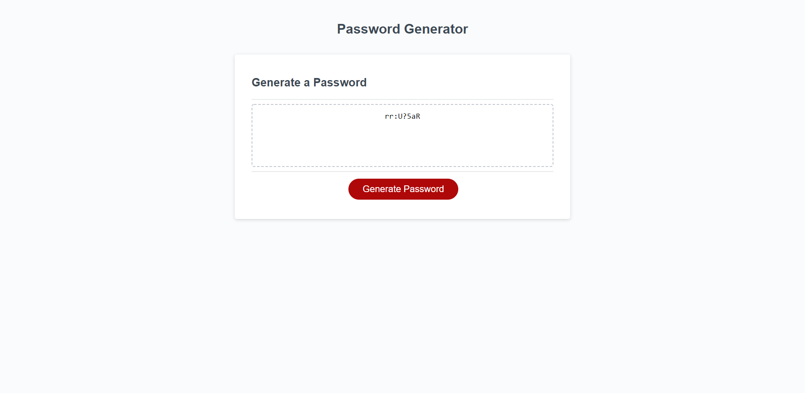

# Password Generator

## Description
I edited this code to generate a password based on the user's requirements. Security is important, and having a good password is a part of that. Strong passwords can seem very random and generally no meaning to them that someone can easily guess. Password generators can help those who are having trouble thinking of a random password and can create a password with characters the user wants to use.

I learned a lot, and got some practice with functions. I learned how to use isNaN and how to implement for loops.

## Screenshot

## Link
<a href="https://aurorabrynn.github.io/password-generator/">Github Link</a>